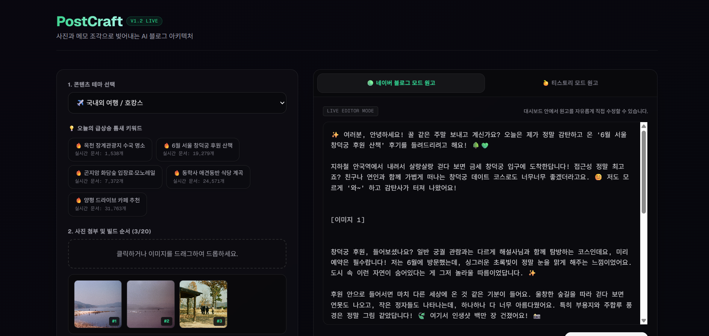

### 1. Intro



- **프로젝트명**: Postcraft
- **프로젝트 설명**: 사용자가 작성한 메모로부터 네이버 블로그 및 티스토리 포스팅 초안을 AI로 자동 생성하는 웹 애플리케이션
- **프로젝트 기간**: 2026.06.20 ~ 2026.06.21
- **사용 스택**: Next.js (App Router), React, TypeScript, TailwindCSS, Vercel
- **배포 링크**: https://postcraft-rev2k06h2-otcrozs-projects.vercel.app/

### 2. Feature

- 사용자 입력(테마, 메모, 이미지 수 등)으로 플랫폼별(네이버, 티스토리) 포스팅 초안 자동 생성
- Gemini(Generative Language) API 연동을 통한 자연어 생성
- 네이버 실시간 키워드 크롤링 및 추천/스코어링
- 이미지 슬롯 자동 배치 지시 및 플랫폼별 포맷 최적화
- API 엔드포인트: [app/api/generate/route.ts](app/api/generate/route.ts), [app/api/keywords/route.ts](app/api/keywords/route.ts)

### 3. 기대효과

- **콘텐츠 생산성 향상**: 짧은 시간 내에 플랫폼 맞춤형 글 초안을 다수 생성하여 콘텐츠 퍼블리싱 속도 향상
- **SEO 개선**: 실시간 키워드 기반 추천과 플랫폼 별 최적화를 통해 검색 노출 가능성 증대
- **운영 효율화**: 마케터·콘텐츠 작성자의 반복 작업 감소로 전략 기획에 더 많은 시간 투입 가능
- **스케일 확장성**: API와 배포 파이프라인을 통해 자동화된 대량 콘텐츠 생성 워크플로우로 확장 가능

### 4. 프로젝트 실행 방법

- 사전 준비: 루트에 `.env.local` 파일 생성
  - 예시 변수:
    - `NEXT_PUBLIC_GEMINI_API_KEY=...`
    - `NEXT_PUBLIC_NAVER_CLIENT_ID=...`
    - `NAVER_CLIENT_SECRET=...`
- 설치 및 실행:
  ```bash
  npm install
  npm run dev      # 개발 서버
  npm run build    # 프로덕션 빌드
  npm start        # 빌드 후 실행
  ```

### 5. 트러블 슈팅

- Naver 환경변수 설정 문제
  - 문제 상황: API 호출 시 401/403 또는 인증 관련 헤더 오류 발생
  - 확인사항:
    1. Vercel의 Environment Variables에 `NEXT_PUBLIC_NAVER_CLIENT_ID` 및 `NAVER_CLIENT_SECRET`이 정확히 등록되어 있는지 확인
    2. 변수명이 대·소문자까지 정확한지 확인
    3. 로컬 개발 시 `.env.local`을 생성했는지, 파일이 `.gitignore`로 제외되어 있는지 확인
    4. 서버에서 사용하는 키는 공개되지 않도록 `NAVER_CLIENT_SECRET`은 `NEXT_PUBLIC_` 접두사를 붙이지 말 것
  - 해결 방법: Vercel → Project Settings → Environment Variables에 키 추가 후 배포 재시도

- 프롬프팅 및 키워드 추천 시스템
  - 목표: 사용자가 입력한 간단한 메모/테마로부터 플랫폼별(네이버/티스토리) 최적화된 포스팅을 생성하기 위해, 내부적으로 두 단계로 처리
    1. 실시간 키워드 수집: `app/api/keywords/route.ts`가 네이버 검색 결과 페이지를 스크래핑하여 연관 키워드 상위 4~5개를 추출
    2. 프롬프트 구성: 추출된 키워드와 사용자가 입력한 메모를 종합해 AI(Gemini)에 전달할 `system prompt`를 구성

  - 프롬프트 예시 구조:
    - 플랫폼별 지침(문체, 줄바꿈, 이미지 배치 규칙)
    - 추출된 연관 키워드를 자연스럽게 본문에 반복 노출하도록 지시
    - 출력 형식: 프론트엔드가 파싱하기 쉬운 JSON 문자열로 반환
